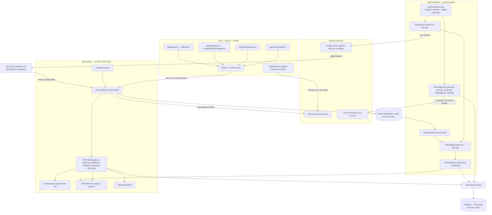

# Mapa interno — procovar-rutas

Aplicación administrativa (el vendedor no entra) que convierte los `.gpx` que las
tabletas suben a Google Drive en un historial consultable: quién trabajó cada día,
por dónde anduvo, y si pasó por los clientes que tenía pedidos ese día. Resuelve el
problema de que hoy esa comprobación es "descargar el `.gpx`, abrirlo en otro
programa, y mirar los kilómetros" — que además miente, porque un teléfono quieto
también acumula kilómetros de temblor del GPS.

## Diagrama

## Piezas

| Pieza | Dónde vive | De qué se ocupa |
|---|---|---|
| Servidor HTTP | `api/cmd/api/main.go`, `internal/api/server.go` | Arranca todo, monta las rutas con chi, expone `/health` |
| Manejadores | `internal/api/*.go` (gps, panel, pedidos, revisar, report, admin) | Traduce peticiones HTTP a consultas y respuestas JSON |
| Alcance por rol | `internal/scope` | Filtra qué vendedores puede ver cada sesión (tabla `supervision`, por fecha) |
| Motor del día | `internal/metrics/day.go`, `geo.go` | Decide el veredicto de la jornada: km, cobertura, inmovilidad por radio |
| Ingesta | `api/cmd/ingest/main.go`, `internal/ingest/*.go` | Barrido de Drive (incremental/nocturno/backfill) y consumo de la cola de n8n |
| Lectura de Drive | `internal/drive/drive.go` (+ `fake.go` para pruebas) | Habla con la API de Google Drive por una interfaz, sustituible en tests |
| Parser GPX | `internal/gpx/parse.go`, `alias.go` | Lee el `.gpx` y resuelve fichero → vendedor (carpeta o alias de tableta) |
| Cruce con PEDIDO | `internal/pedido/*.go` | Trae pedidos y clientes (solo lectura), empareja vendedores por nombre |
| Acceso a datos | `internal/store` (sqlc) | Consultas SQL generadas, único punto que toca Postgres |
| Cola | `internal/queue` | Cola en Redis para lo que empuja n8n |
| Avisos en vivo | `internal/events` | SSE sobre Redis para refrescar el panel sin recargar |
| Auth | `internal/auth` | Cliente de procovar-auth (Accesos): login, sesión, token |
| Migraciones | `api/cmd/migrate/main.go`, `api/migrations/*.sql` | Esquema versionado, empotrado en el binario |
| Autorización Google | `api/cmd/authorize/main.go` | Genera el token de refresco de una cuenta de Google |
| Middleware de sesión | `front/middleware.ts` | Corta el render si no hay cookie, antes de mandar HTML |
| Cliente de API | `front/lib/api.ts`, `lib/events.ts` | Único punto del front que habla con la API; sin filtros de rol en el navegador |
| Calendario | `front/app/page.tsx` | Pantalla de entrada: cuadrícula vendedor × día laborable |
| Visor | `front/app/dia/page.tsx`, `components/RouteMap.tsx` | Mapa Leaflet por capas: recorrido, paradas, clientes |
| Reporte | `front/app/reporte/page.tsx` | Documento semanal |
| Revisar | `front/app/revisar/page.tsx` | Bandeja de ficheros sin dueño y emparejamientos de PEDIDO |
| Flujo n8n | `n8n/construir-ingesta.py`, `crear-procesados.py` | Genera por script el flujo de n8n que vigila Drive y empuja a la API |

## Las fronteras

- **Google Drive** — `internal/drive`, solo lectura, una cuenta de Google por sucursal
  (más la cuenta padre `tablets.procovar` que ve las 53 carpetas). Nunca se borra ni
  se mueve nada desde aquí.
- **n8n** — automatización externa que vigila las carpetas y llama a
  `POST /api/ingest/file` con clave de servicio. Es el camino rápido; el barrido
  propio (`cmd/ingest`) es la red de seguridad, ambos idempotentes por
  `driveFileId` + `sha256`.
- **PEDIDO** — `internal/pedido/client.go`, HTTP con `x-api-key`, **solo lectura**,
  dentro de la misma red interna de Docker (`dokploy-network`): el tráfico no sale
  de la máquina. Opcional: sin `PEDIDO_API_URL` el panel arranca igual, sin la
  columna de clientes.
- **procovar-auth (Accesos)** — `internal/auth`, login/callback OAuth y reparto de
  permisos; el front comparte la cookie `qb.session_token` en `*.procovar.cloud`.
- **Postgres** — base propia (`procovar_rutas`), instancia compartida del servidor,
  accedida solo desde `internal/store`.
- **Redis** — instancia compartida, aislada por el prefijo `procovar-rutas:`, para la
  cola de n8n y las notificaciones en vivo (SSE).
- **Dispositivos** — no hay conexión directa; los vendedores suben el `.gpx` con
  **GPSLogger 135** (mendhak) a su carpeta de Drive, sin API ni app propia.

## Por dónde entrar

1. **`README.md`** — explica el problema, cómo llegan los datos de Drive y las
   decisiones no obvias (zona horaria, `track_day`, radio de inmovilidad, PEDIDO).
2. **`api/cmd/api/main.go`** — arranque real: qué es opcional (Google, Redis,
   PEDIDO) y qué pasa si falta cada cosa.
3. **`api/internal/api/server.go`** — todas las rutas HTTP y qué permiso exige cada
   una; es el mapa de lo que existe de verdad en el panel.
4. **`api/internal/metrics/day.go`** — el veredicto del día: por qué un teléfono
   quieto no cuenta como trabajado.
5. **`front/components/RouteMap.tsx`** — cómo se leen las tres capas del visor
   (recorrido, paradas, clientes) y por qué se apagan por separado.

## Estado

No está abandonado: el commit más reciente es del 29/08/2026 (una semana antes de
esta nota) y el propio `README.md` lo confirma con una lista de lo hecho. Según esa
lista, casi todo el código está terminado y probado (parser, ingesta, motor del día,
API, front, cola, cruce con PEDIDO), pero **todavía no está desplegado**: faltan el
backfill real de los 1795 ficheros de Drive y el despliegue en Dokploy. Es decir, es
un proyecto completo en desarrollo local, pendiente de su primera puesta en marcha
contra el servidor de verdad.

Un detalle suelto que conviene mirar antes de desplegar: el `healthcheck` de
`docker-compose.yml` llama a `http://localhost:3600/salud`, pero la ruta que expone
`internal/api/server.go` es `/health`. Con eso el contenedor `api` no pasaría nunca
el healthcheck en Dokploy.
